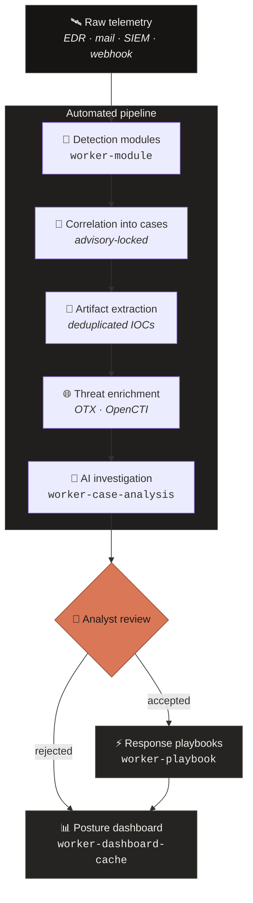
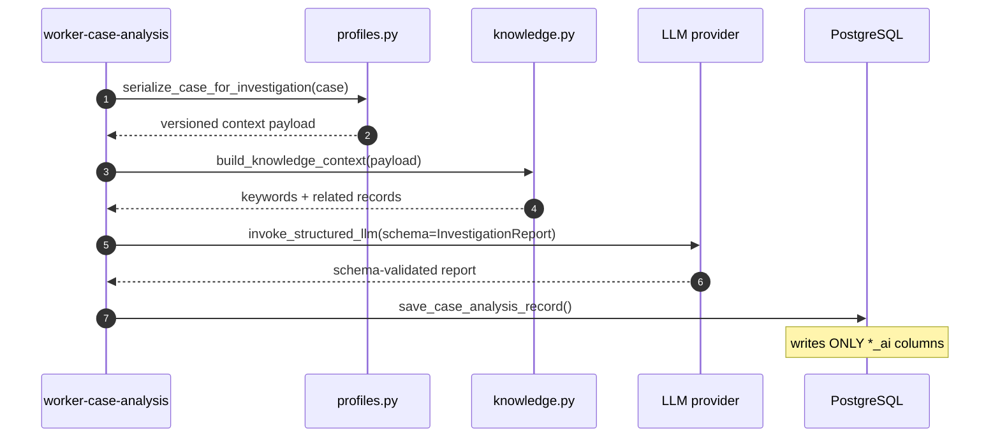
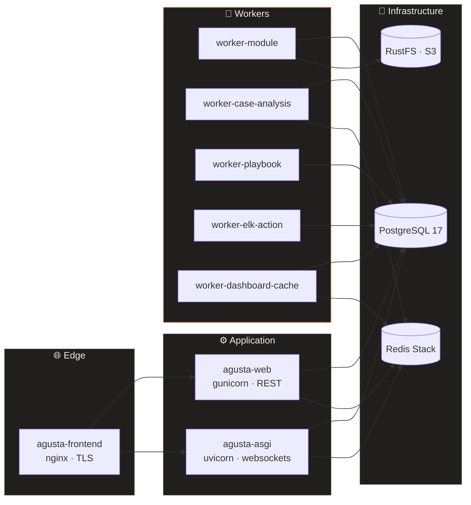

<div align="center">


<a href="#-what-agusta-does">
  
</a>

<br/>


<br/>


</div>


## 🜂 The one-paragraph version

A Security Operations Centre drowns in alerts. The scarce resource is not detection
coverage — it is **analyst attention**. AGUSTA ingests security alerts, correlates them
into cases, enriches indicators against threat intelligence, and runs an LLM-driven
investigation that returns a **schema-validated verdict** with its reasoning. It then
executes response playbooks against your SIEM.

What it deliberately does *not* do is decide. The model writes to a parallel set of
AI-owned fields; a human analyst owns the canonical severity. That boundary is enforced
in code, not in a policy document.

<br/>

<div align="center">

| | |
|:--|:--|
| 🧠 **Reasons, not just scores** | Structured investigation reports, not a numeric risk blob |
| 🔗 **Correlates by design** | Race-safe case grouping under concurrent ingestion |
| 🛡️ **Human-in-the-loop, enforced** | AI verdicts cannot move your risk posture unaided |
| 🔌 **No vendor lock-in** | Any OpenAI-compatible LLM, selected by capability tag |
| 🧩 **Extensible without forking** | Drop a Python module in; core stays untouched |
| 📦 **Demoable on first boot** | Seeds a coherent, provenance-tracked dataset |

</div>


<details>
<summary><b>📖 Table of contents</b> — click to expand</summary>

- [What AGUSTA does](#-what-agusta-does)
- [How it works](#-how-it-works)
- [The AI investigation](#-the-ai-investigation)
- [The human-in-the-loop guarantee](#-the-human-in-the-loop-guarantee)
- [Architecture](#-architecture)
- [Tech stack](#-tech-stack)
- [Quick start](#-quick-start)
- [Demo data and provenance](#-demo-data-and-provenance)
- [Project structure](#-project-structure)
- [Scalability and known limits](#-scalability-and-known-limits)
- [Security posture](#-security-posture)
- [Licence and attribution](#-licence-and-attribution)

</details>

## 🜁 What AGUSTA does

| Capability | Description | Implemented in |
|---|---|---|
| **Alert ingestion** | Detection modules normalise raw vendor telemetry into alerts | `agentic/services/alerts.py`, `backend/modules/` |
| **Case correlation** | Related alerts group into one investigable case | `agentic/services/alerts.py` |
| **Artifact extraction** | IOCs — hashes, IPs, domains, users, hosts — linked and deduplicated | `agentic/services/artifacts.py` |
| **Threat enrichment** | Artifacts scored against threat-intel providers | `integrations/threat_intel/` |
| **AI investigation** | LLM produces a schema-validated investigation report | `agentic/analysis/` |
| **Response playbooks** | Automated containment and response actions | `agentic/services/playbooks.py` |
| **Posture dashboard** | Windowed metrics, risk index, MTTD / MTTA / MTTR | `apps/dashboard/views.py` |

## 🜃 How it works



The whole first half of that diagram — ingestion, correlation, artifact linking,
enrichment, and the handoff to AI — happens inside **one atomic transaction** in
`create_alert_with_context()`. It is under a hundred lines and readable in a single
screen.

> **Concurrency detail worth knowing:** correlation uses a PostgreSQL advisory lock
> (`pg_advisory_xact_lock`) keyed on a SHA-256 of the correlation UID. Two workers
> processing related alerts simultaneously cannot create duplicate cases.

## 🜄 The AI investigation



Four explicit steps, defined in `run_case_analysis()`:

1. **Serialise** the case into a versioned payload. `AI_PROFILE_VERSION` is stored with
   every result, so any verdict is traceable to the context schema that produced it.
2. **Retrieve** related knowledge-base material and attach it to the prompt.
3. **Invoke** the LLM constrained by a Pydantic schema. Malformed output fails
   validation rather than entering the database — there is no regex-parsing of prose.
4. **Persist** to AI-owned columns.

## 🜔 The human-in-the-loop guarantee

`save_case_analysis_record()` writes exactly six fields:

```
verdict_ai · severity_ai · impact_ai · priority_ai · confidence_ai
investigation_report_ai_json
```

It never touches the analyst-owned `severity`. The dashboard reads **zero** `_ai` fields.

The consequence is testable: the model can conclude *critical* and the Critical Cases
tile will not move, and the Active Risk Index will not move, until a human accepts the
finding. An LLM that could silently downgrade a risk score is a liability, not a feature.

## 🜍 Architecture

Eleven long-running services and two one-shot init jobs.



Each worker is a **separate process**, so a thirty-second LLM call cannot block alert
ingestion. That isolation is the core scaling property.

<details>
<summary><b>Service responsibilities</b></summary>

| Service | Role |
|---|---|
| `agusta-frontend` | nginx, TLS termination, serves the SPA and static files |
| `agusta-web` | gunicorn / WSGI REST API — 3 workers × 4 threads by default |
| `agusta-asgi` | uvicorn / ASGI — websockets and realtime push |
| `agusta-worker-module` | Detection module execution |
| `agusta-worker-case-analysis` | AI investigations |
| `agusta-worker-playbook` | Playbook orchestration |
| `agusta-worker-elk-action` | Elastic / SIEM actions |
| `agusta-worker-dashboard-cache` | Metric precomputation |
| `postgres:17` | Primary datastore, tuned via compose parameters |
| `redis/redis-stack` | Cache, queues, channel layer |
| `rustfs` | S3-compatible object storage |
| `agusta-migrate` | One-shot: migrations, seeding, init |
| `agusta-custom-deps` | One-shot: installs operator-supplied Python packages |

</details>

<details>
<summary><b>Extensibility model</b></summary>

Detection modules and playbooks resolve through an **official + custom overlay**. Bundled
content ships inside the image; operator content mounts at `/app/custom` and is added to
`PYTHONPATH`. An analyst drops a Python module into `custom/modules/` and it is picked up
with no core changes, no fork, and no image rebuild.

</details>

## 🜚 Tech stack

<details open>
<summary><b>Backend</b> — Python 3.14+</summary>

<br/>

| Area | Libraries |
|---|---|
| Framework | Django ≥ 6.0.6 · Django REST Framework 3.17.1 |
| Auth | SimpleJWT 5.5.1 · `ldap3` 2.9.1 · API keys · RBAC |
| Realtime | Channels ≥ 4.3.2 · channels-redis |
| Data | psycopg2-binary · django-filter 25.2 · django-redis 7.0.0 |
| Storage | django-storages[boto3] 1.14.6 |
| API schema | drf-spectacular — OpenAPI 3 + Swagger UI |
| Servers | gunicorn 26.0.0 · uvicorn 0.49.0 |

</details>

<details>
<summary><b>AI / LLM layer</b></summary>

<br/>

| Area | Libraries |
|---|---|
| Orchestration | langchain-core 1.4.8 · langchain-openai 1.3.3 |
| Structured output | Pydantic 2.13.4 |
| Provider model | Any OpenAI-compatible endpoint, configured at runtime |

Providers live in the database (`LLMProviderConfig`) with `base_url`, `model`, capability
`tags`, `priority` and `enabled`. Investigations request a provider **by capability tag**
(`structured_output`) rather than by name, giving priority-ordered failover. Switching
model or vendor is a settings change, not a redeploy.

</details>

<details>
<summary><b>Security integrations</b></summary>

<br/>

| Target | Library |
|---|---|
| Elasticsearch / ELK | `elasticsearch` 9.4.1 |
| Splunk | `splunk-sdk` 2.1.1 |
| OpenCTI | `pycti` |
| AlienVault OTX | HTTP via `httpx` 0.28.1 |
| Directory services | `ldap3` 2.9.1 |

</details>

<details>
<summary><b>Frontend</b></summary>

<br/>

| Area | Libraries |
|---|---|
| Core | React 19.2 · TypeScript ~6.0 · Vite 8.1 |
| UI | Ant Design 6.5 · `@ant-design/charts` · lucide-react |
| State / routing | zustand 5 · react-router-dom 7 |
| Editors | CodeMirror · markdown and JSON viewers |

Theming is centralised: `src/palette.ts` holds the design tokens — warm dark surfaces with
a terracotta accent — and `src/theme.ts` maps them onto Ant Design component tokens. The
look is driven by the design system rather than scattered CSS overrides.

</details>

<details>
<summary><b>Tooling</b></summary>

<br/>

`uv` for Python dependencies · `pnpm` 10.16.1 · ESLint 10 · Docker Compose · nginx ·
GitHub Actions for CI, CodeQL, Docker and releases

</details>

## 🜛 Quick start

> **Prerequisites:** Docker and Docker Compose. Roughly 4 GB RAM available.

<details open>
<summary><b>1 · Configure</b></summary>

```bash
cd deploy/agusta-compose
cp .env.example .env
```

Edit `.env` and set, at minimum, `POSTGRES_PASSWORD`, `REDIS_PASSWORD`,
`RUSTFS_ACCESS_KEY` and `RUSTFS_SECRET_KEY`. If port 443 is occupied, set
`AGUSTA_HTTPS_PORT` to something free such as `8443`.

</details>

<details open>
<summary><b>2 · Create the mount points</b></summary>

```bash
mkdir -p certs logs/nginx custom/modules custom/playbooks \
         custom/data/modules custom/data/playbooks custom/data/siem
```

</details>

<details open>
<summary><b>3 · Provide a TLS certificate</b></summary>

Place `agusta.crt` and `agusta.key` in `certs/`. For a local demo, a self-signed pair is
fine:

```bash
openssl req -x509 -newkey rsa:2048 -nodes -days 365 \
  -keyout certs/agusta.key -out certs/agusta.crt -subj "/CN=localhost"
```

</details>

<details open>
<summary><b>4 · Migrate, seed and launch</b></summary>

```bash
docker compose run --rm agusta-migrate
docker compose up -d
```

Then open **https://localhost** (or your `AGUSTA_HTTPS_PORT`). The migrate step also
seeds the demo dataset, so the platform is populated on first load.

</details>

<details>
<summary><b>5 · Connect an LLM provider</b></summary>

<br/>

Navigate to **Settings → LLM Providers** and add any OpenAI-compatible endpoint:

| Field | Example |
|---|---|
| `base_url` | `https://api.groq.com/openai/v1` |
| `model` | `llama-3.3-70b-versatile` |
| `tags` | must include `structured_output` |

The `structured_output` tag is required — investigations resolve their provider by that
tag and will raise if no tagged provider exists. Workers refresh configuration on their
next poll, so no restart is needed.

> Pick a model with adequate token throughput. A full case context can approach ~9,000
> tokens, which exceeds the per-minute allowance on some free tiers.

</details>

<details>
<summary><b>Environment reference</b></summary>

<br/>

| Variable | Default | Purpose |
|---|---|---|
| `AGUSTA_HTTPS_PORT` | `443` | Host port for the UI |
| `AGUSTA_WEB_WORKERS` | `3` | gunicorn worker processes |
| `AGUSTA_WEB_THREADS` | `4` | Threads per worker |
| `AGUSTA_DEMO_DATA` | `auto` | Demo seeding — `auto` / `on` / `off` |
| `AGUSTA_DEMO_REPLAY` | — | Replay bundled raw alerts through the live pipeline |
| `POSTGRES_MAX_CONNECTIONS` | `150` | Connection ceiling |
| `POSTGRES_SHARED_BUFFERS` | `512MB` | PostgreSQL cache |

</details>

## 🜏 Demo data and provenance

A fresh deployment seeds a coherent, interconnected environment — cases, alerts,
artifacts, enrichments, knowledge entries, playbook history and multi-day activity —
arranged as several linked incident narratives alongside routine benign traffic. Seeding
is **idempotent** and controlled by `AGUSTA_DEMO_DATA`. A seeding failure will not abort a
deployment whose migrations succeeded.

Provenance is tracked explicitly in `backend/apps/common/demo/provenance.py`:

<table>
<tr><th align="left">Real, publicly sourced</th><th align="left">Synthetic</th></tr>
<tr valign="top">
<td>

- MITRE ATT&CK technique IDs
- A CISA KEV catalogue CVE
- The EICAR test-file hash

</td>
<td>

- All hosts, users, IPs and domains
- Confined to RFC 5737 and RFC 2606 reserved ranges
- No real-world asset is ever labelled malicious

</td>
</tr>
</table>

**Nothing generated is presented as real threat activity.**

## 🜖 Project structure

```
agusta/
├── backend/
│   ├── apps/
│   │   ├── agentic/              ← the AI engine
│   │   │   ├── analysis/         ← agent loop, prompts, schemas, retrieval
│   │   │   ├── services/         ← alerts · cases · artifacts · playbooks
│   │   │   ├── runtime/          ← module loading, worker loops
│   │   │   └── management/       ← worker entry points
│   │   ├── alerts/  cases/  artifacts/  enrichments/  playbooks/
│   │   ├── dashboard/            ← metrics and the risk index
│   │   ├── knowledge/            ← knowledge base
│   │   ├── accounts/             ← JWT · API keys · LDAP · RBAC
│   │   ├── audit/                ← audit trail
│   │   ├── settings/             ← runtime provider configuration
│   │   └── common/demo/          ← demo dataset and provenance
│   ├── integrations/
│   │   ├── llm/  siem/  threat_intel/  cmdb/
│   ├── modules/                  ← bundled detection modules
│   ├── playbooks/                ← bundled playbooks
│   └── data/playbooks/           ← LLM prompt templates
├── frontend/src/
│   ├── pages/  components/  api/  stores/
│   ├── palette.ts                ← design tokens
│   └── theme.ts                  ← Ant Design token mapping
├── cli/                          ← agusta command-line client
└── deploy/agusta-compose/        ← compose.yaml and deployment assets
```

<details>
<summary><b>Files worth reading first</b></summary>

<br/>

| Path | What it holds |
|---|---|
| `backend/apps/agentic/services/alerts.py` | Ingestion → correlation → artifacts → enrichment, one transaction |
| `backend/apps/agentic/analysis/analysis.py` | The agent loop — `run_case_analysis()` |
| `backend/apps/agentic/analysis/schemas.py` | `InvestigationReport` output contract |
| `backend/apps/agentic/services/cases.py` | `save_case_analysis_record()` — the AI field boundary |
| `backend/apps/dashboard/views.py` | `build_active_risk_index()` and metric queries |
| `backend/apps/settings/models.py` | `LLMProviderConfig` and integration configuration |
| `deploy/agusta-compose/compose.yaml` | Full service topology |

</details>

## 🜂 Scalability and known limits

Stated plainly. These are scope decisions, not oversights.

**What scales**

- Stateless web and ASGI tiers scale by replica count behind nginx; JWT means no session
  affinity
- Workload isolation across five worker types — a slow LLM call cannot block ingestion
- PostgreSQL tuned through compose parameters rather than left at defaults
- Expensive dashboard aggregates precomputed by a dedicated cache worker
- Indexed for volume on the highest-traffic table (`alert_created_id_idx`,
  `alert_event_time_idx`)
- Object storage offloaded to RustFS, scaling independently

**What does not, yet**

| Limit | Detail |
|---|---|
| Worker replicas do not multiply throughput | Job claiming uses `select_for_update()` without `skip_locked`, so replicas serialise on the oldest pending row. Correct, but not parallel |
| Polling rather than push | Workers poll on an interval; Redis is deployed but not used as a job broker |
| Single PostgreSQL instance | No read replicas, no partitioning on `alerts` |
| LLM throughput is the real ceiling | Provider rate limits cap investigations per minute; no batching, no local inference |
| Retrieval is lexical, not semantic | Keyword matching, no embeddings. Keeps the footprint small; weaker recall on paraphrased content |
| Single-node Compose | No Kubernetes manifests, no autoscaling policy |
| Single-tenant | One deployment per organisation |
| No automated backup | Named volumes only; no restore runbook or RPO/RTO target |

## 🜎 Security posture

| Area | Implementation |
|---|---|
| Authentication | SimpleJWT, API keys, LDAP via `ldap3` |
| Authorisation | Role-based, in `accounts/permissions.py` |
| Transport | TLS terminated at nginx |
| Audit | Dedicated `audit` app recording state changes |
| Data integrity | `@transaction.atomic`, `select_for_update` on every state transition, `full_clean()` before save, state-machine guards rejecting invalid transitions |
| Fault recovery | `recover_orphaned_playbook_runs()` reclaims runs abandoned by a crashed worker |
| Health | `/api/health/` endpoints, per-worker health reporting, compose healthchecks |
| Static analysis | CodeQL in CI |

**Known gaps:** secrets are plaintext in `.env` with no vault integration; there is no
Prometheus/Grafana or distributed tracing; there is no AI evaluation harness or drift
monitoring.

> ⚠️ TLS keys, `.env` files and runtime logs are excluded from version control by
> `.gitignore`. Generate your own certificates and credentials per deployment.


## 🜅 Licence and attribution

Released under the **MIT Licence** — see [`LICENSE`](./LICENSE).

AGUSTA is a derivative work. It builds on the upstream open-source Agentic SOC Platform
project, used under the terms of the MIT Licence, and the original copyright notice is
retained in [`LICENSE`](./LICENSE) alongside ours. Our thanks to that project's authors
for the foundation.

<div align="center">
<br/>

**AGUSTA** · built by **AdaptX**

<sub>The AI recommends. The analyst decides.</sub>


</div>
